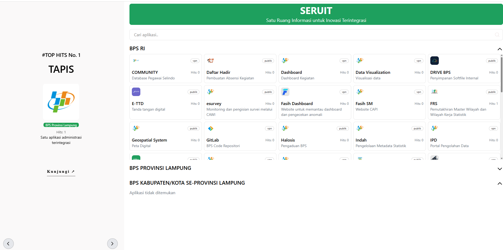
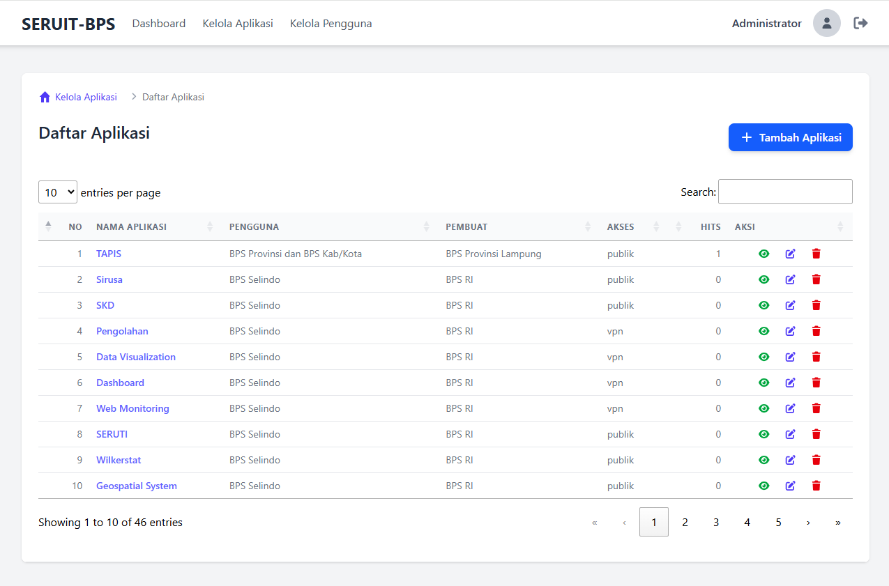

## Tentang SERUIT

SERUIT merupakan suatu wadah atau ruang untuk mendokumentasikan berbagai inovasi, baik di BPS RI, BPS Provinsi Lampung, dan BPS Kab/Kota se-Provinsi Lampung.

## Persyaratan Sistem

Sebelum instalasi, pastikan sudah terpasang:

-   PHP >= 8.1
-   Composer
-   Node.js & NPM
-   MySQL / MariaDB
-   Git

## Langkah Instalasi

1. **Clone repository**
    ```bash
    git clone https://github.com/bps1800/seruit-app.git
    cd nama-project
    ```
2. **Install dependency backend (Laravel) dan frontend (Tailwind / JS)**
    ```bash
    composer install
    npm install
    ```
3. **Buat file `.env`**
    ```bash
    cp .env.example .env
    ```
4. **Generate key aplikasi**
    ```bash
    php artisan key:generate
    ```
5. **Migrasi database**
    ```bash
    php artisan migrate --seed
    ```
6. **Jalankan server lokal**
    ```bash
    php artisan serve
    ```
7. **Jalankan build frontend**
    ```bash
    npm run dev
    ```

**Catatan**

-   Untuk production, gunakan `npm run build`.
-   Jangan lupa set permission folder `storage` dan `bootstrap/cache`.

## Tampilan




