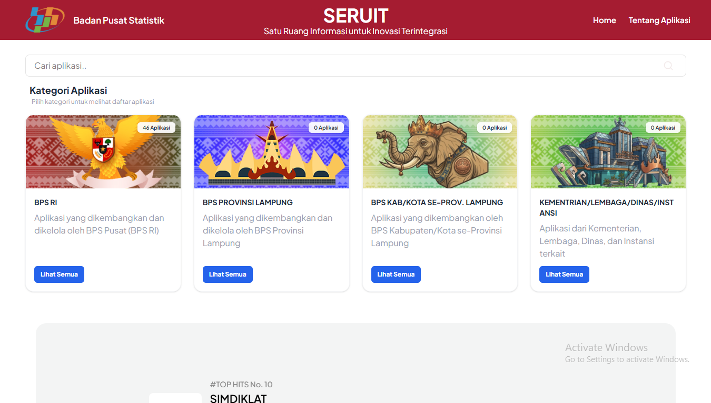

## Tentang SERUIT

SERUIT merupakan suatu wadah atau ruang untuk mendokumentasikan berbagai inovasi, baik di BPS RI, BPS Provinsi Lampung, dan BPS Kab/Kota se-Provinsi Lampung.

## Persyaratan Sistem

Sebelum instalasi, pastikan sudah terpasang:

- PHP >= 8.1
- Composer
- Node.js & NPM
- MySQL / MariaDB
- Git

## Langkah Instalasi

1. **Clone repository**
    ```bash
    git clone https://github.com/bps1800/seruit-app.git
    cd nama-project
    ```
2. **Install dependency backend (Laravel) dan frontend (Tailwind / JS)**
    ```bash
    composer install
    npm install
    ```
3. **Buat file `.env`**
    ```bash
    cp .env.example .env
    ```
4. **Generate key aplikasi**
    ```bash
    php artisan key:generate
    ```
5. **Migrasi database**
    ```bash
    php artisan migrate --seed
    ```
6. **Jalankan server lokal**
    ```bash
    php artisan serve
    ```
7. **Jalankan build frontend**
    ```bash
    npm run dev
    ```

**Catatan**

- Untuk production, gunakan `npm run build`.
- Jangan lupa set permission folder `storage` dan `bootstrap/cache`.

## Tampilan




## Perbaikan

- [2026/03/18] Integrasi Tailwind CSS, penambahan halaman "Tentang SERUIT", implementasi carousel baru, serta peningkatan UI/UX secara keseluruhan
- [2026/03/17] Perbaikan struktur header, penyesuaian margin, dan penyempurnaan styling komponen
- [2026/03/13] Refactor struktur card dan peningkatan konsistensi tampilan
- [2026/03/12] Peningkatan UI carousel (layout, animasi, dan navigasi), serta perbaikan header dan dropdown
- [2026/03/11] Implementasi pencarian real-time, halaman detail aplikasi, dan modal konfirmasi
- [2026/03/10] Perbaikan layout category card, penyesuaian grid, dan peningkatan struktur HTML

- [2025/09/08] Perbaikan tampilan beranda, penambahan K/D/L/I
